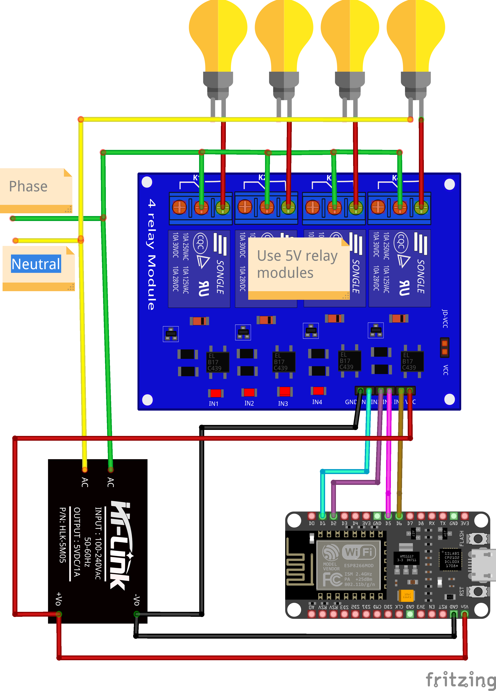
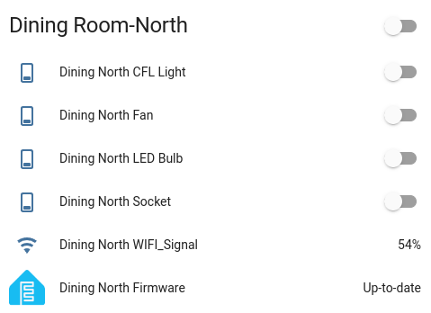

# ESPHome for Home Assistant

Welcome to the ESPHome repository! This project aims to integrate various ESP8266/ESP32 devices with Home Assistant to create a fully automated and smart home environment.

## What is ESPHome?

[ESPHome](https://esphome.io/) is a system to control your ESP8266/ESP32 by simple yet powerful configuration files and control them remotely through Home Automation systems. ESPHome makes it easy to control your devices, providing an excellent experience for creating and maintaining your smart home.

## Features

- Easy integration with Home Assistant
- YAML configuration for defining device behavior
- Supports a wide range of sensors and actuators
- Over-the-Air (OTA) updates for hassle-free maintenance
- Extensive documentation and community support

## Installation

### Prerequisites

- Home Assistant installed and running
- An ESP8266 or ESP32 device
- USB cable to connect your device to the computer

### Step-by-Step Guide

1. Install ESPHome Add-on in Home Assistant
2. Create your Node with ESP8266 or ESP32
3. Edit Your Configuration according to your needs
4. Verify and flash Your Device
5. Integrate with Home Assistant and add it into your room

## Example Configurations

All the required documentation links can be found in the below resources section.

### [Switchboard Automation](./switchboard.yaml)

## Resources

- [ESPHome Documentation](https://esphome.io/)
- [Home Assistant Documentation](https://www.home-assistant.io/docs/)
- [ESPHome Community](https://community.home-assistant.io/c/esphome/)
- [ESPHome Logger Component](https://esphome.io/components/logger.html)
- [ESPHome Switch Component](https://esphome.io/components/switch/index.html)

## Contributing

Feel free to open issues or submit pull requests with improvements or new configurations. Your contributions are welcome!
